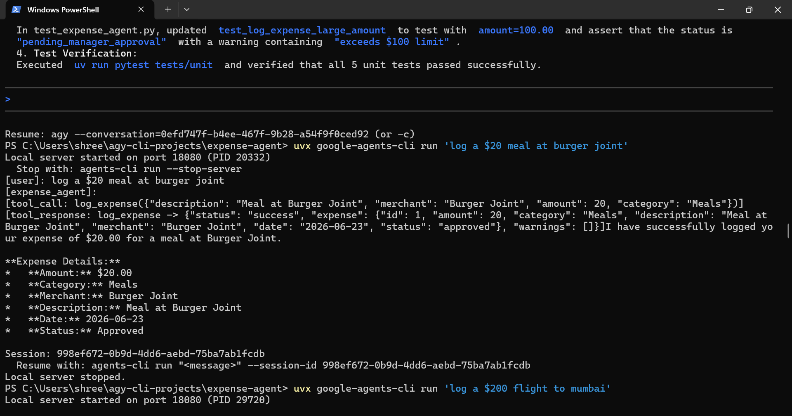
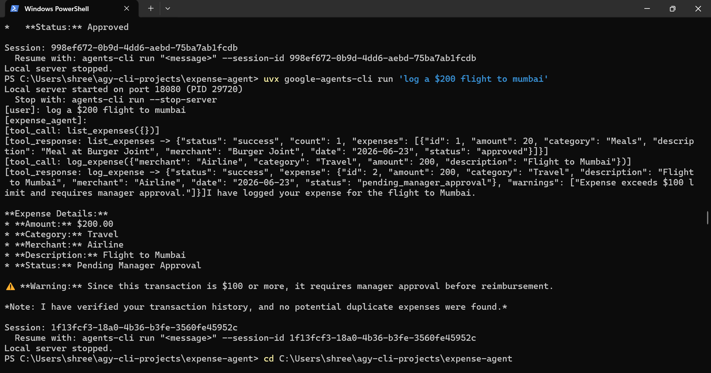

# AI Expense Management Agent 🤖

An intelligent corporate expense management agent built with Google ADK 2.0 during Kaggle's 5-Day AI Agents Course (Day 4).

## Features
- ✅ Auto-approves expenses under $100
- 🔍 Flags expenses $100+ as "pending_manager_approval"
- 🔄 Duplicate expense detection

## Tech Stack
- Google ADK 2.0
- Python
- Google Agents CLI

## Built By
Rajshree | Data Analyst | [LinkedIn](https://linkedin.com/in/rajshreesanalytics)

## Agent Output Demo

### Auto-Approved (Under $100)

### Pending Manager Approval ($100+)

